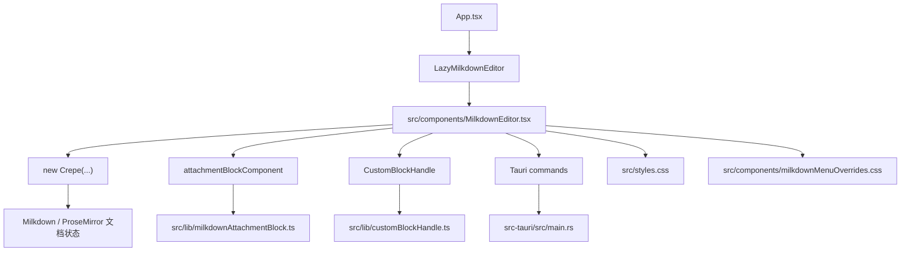
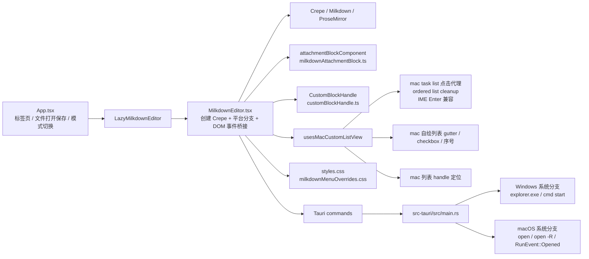

# 编辑器架构与平台适配说明

本文档用于回答 4 个维护问题：

1. 当前编辑器是如何组织的
2. 相比原生 `Milkdown / Crepe` 做了哪些项目级改造
3. 针对 macOS 做了哪些适配
4. 后续如何区分 mac 与 Windows 的适配边界，避免继续把平台问题混在一起

## 1. 基础栈与运行方式

- 应用框架：`Tauri + React + TypeScript`
- 编辑器内核：`@milkdown/crepe`
- 文档模型：`Milkdown / ProseMirror`
- 桌面能力：通过 `src-tauri/src/main.rs` 暴露 Tauri commands 给前端调用

当前编辑器不是通过 `@milkdown/react` 挂载的，而是直接在 React 组件里创建 `new Crepe(...)`。`@milkdown/react` 仍然在依赖里，但当前运行路径并没有使用它。

## 2. 运行时结构总览

### 2.1 结构图一：当前现状

当前结构的特点是：

- 编辑器主路径集中在 `MilkdownEditor.tsx`
- mac 兼容逻辑分散在 `TS + CSS + handle` 三层
- Windows 编辑器层主要还是默认路径，没有独立适配层
- 系统层平台分支在 Rust 中相对清晰

### 2.2 结构图二：计划中的收口方案

```mermaid
flowchart LR
  App["App.tsx"] --> Editor["MilkdownEditor.tsx<br/>只保留编辑器生命周期与公共桥接"]
  Editor --> Adapter["editorPlatformAdapter<br/>统一平台适配入口"]

  Adapter --> Common["Common Editor Features<br/>attachment / link / paste / drop / markdown sync"]
  Adapter --> DefaultAdapter["Default Adapter<br/>Windows / 其他平台默认路径"]
  Adapter --> MacAdapter["Mac Adapter<br/>WKWebView / WebKit 兼容路径"]

  DefaultAdapter --> CrepeDefault["Crepe 默认 ListItem / 默认列表行为"]
  MacAdapter --> MacList["mac list strategy<br/>自绘 gutter / task toggle / ordered cleanup / IME guard"]
  MacAdapter --> MacHandle["mac handle strategy"]

  Common --> Attachment["milkdownAttachmentBlock.ts"]
  Common --> Handle["customBlockHandle.ts<br/>仅保留公共能力 + adapter 注入定位策略"]
  Common --> Styles["styles.css / milkdownMenuOverrides.css"]

  Editor --> Commands["Tauri commands"]
  Commands --> Rust["src-tauri/src/main.rs<br/>唯一系统层平台分支入口"]
  Rust --> WinOs["Windows cfg"]
  Rust --> MacOs["macOS cfg"]
```

计划结构的目标是：

- `MilkdownEditor.tsx` 不再同时承担“公共逻辑 + mac workaround + 平台判断”
- 平台差异收口到一个显式 adapter 层
- Windows 继续走默认路径，避免被 mac workaround 污染
- mac 的列表、IME、handle 定位逻辑作为同一适配包维护
- Rust 继续作为系统层平台分支唯一入口

更具体地说：

- `src/App.tsx`
  - 管理标签页、文件打开保存、拖拽导入、编辑模式切换
  - 懒加载 `MilkdownEditor`
  - 把“打开文件”“插入附件”“打开本地路径”等能力以 props 形式传给编辑器
- `src/components/MilkdownEditor.tsx`
  - 编辑器入口
  - 创建和销毁 `Crepe`
  - 处理 Markdown 同步、粘贴/拖拽、图片路径解析、链接点击、平台分支
- `src/lib/milkdownAttachmentBlock.ts`
  - 自定义附件块扩展
  - 包含 remark 转换、Milkdown schema、NodeView、交互插件
- `src/lib/customBlockHandle.ts`
  - 自定义 block handle / 拖拽 / 菜单
  - 当前项目不再依赖原生 Milkdown block handle
- `src/styles.css`
  - 编辑器主体样式
  - 包含 mac 自定义列表 gutter、附件块样式、handle 样式覆盖
- `src/components/milkdownMenuOverrides.css`
  - slash menu 和自定义 block handle 菜单的视觉覆盖
- `src-tauri/src/main.rs`
  - 系统层能力
  - 包含 open/reveal/focus/window restore/open file request 等平台差异逻辑

## 3. 与原生 Milkdown / Crepe 的差异

这里的“原生”指的是直接使用 `Crepe` 默认特性、默认 block handle、默认列表渲染和默认链接/文件行为。

### 3.1 挂载方式不同

原生路径通常是“创建编辑器并使用默认 feature 组合”。当前项目在 `src/components/MilkdownEditor.tsx` 中做了更深的接管：

- 直接在 React 组件内部创建 `new Crepe(...)`
- 在 `create()` 后继续拿到 `editorViewCtx`
- 在 ProseMirror DOM 层补充自定义事件监听
- 在销毁时手动清理所有 listener / observer / timer

这意味着：

- 编辑器不是纯“配置式使用”
- 维护时需要同时看 React 生命周期、Crepe 生命周期、ProseMirror DOM 生命周期

### 3.2 增加了附件块扩展

原生 Milkdown 不带当前项目的“本地附件卡片”能力。项目额外实现了：

- `remarkAttachmentBlockPlugin`
  - 把满足条件的段落链接转换为附件节点
- `attachmentBlockSchema`
  - 新增 `attachment` 节点
- `attachmentBlockInteractionPlugin`
  - 接管点击、双击、导入中状态
- `AttachmentBlockView`
  - 渲染附件卡片、右键菜单、元信息

因此，附件块是项目私有扩展，不属于上游 Crepe 默认能力。

### 3.3 自定义了 block handle，而不是沿用原生实现

当前项目已经把上游 `.milkdown-block-handle` 隐藏掉，改成自己的 `.tinymd-block-handle`。

原因是项目需要：

- 更稳定的 hover 驱动显示逻辑
- 自定义菜单项
- 拖拽排序
- 与 mac 自定义列表 gutter 协同定位

所以，凡是 block handle 相关问题，优先看：

- `src/lib/customBlockHandle.ts`
- `src/styles.css`
- `src/components/milkdownMenuOverrides.css`

而不是去改上游 Milkdown handle 的 DOM。

### 3.4 增加了图片与本地路径解析能力

原生 Milkdown 不负责桌面端本地文件打开和图片 data URL 解析。当前项目在编辑器层增加了：

- 本地图片路径转 `data:` URL 预览
- 相对路径相对于当前 Markdown 文档解析
- 链接点击时区分：
  - 外链：调用 Tauri command 打开系统浏览器
  - 本地路径：交给应用层打开文件

对应入口主要在 `src/components/MilkdownEditor.tsx` 和 `src-tauri/src/main.rs`。

### 3.5 增加了拖拽 / 粘贴导入资产能力

当前编辑器除了文本编辑，还承担了“把本地资源导入到文档附近资产目录”的职责：

- 粘贴文件
- 拖入文件
- 根据文档路径决定资产目录
- 回写 Markdown 链接或图片 Markdown
- 通过 DOM event 同步导入状态

这部分属于应用级能力，不是上游编辑器默认能力。

### 3.6 增加了样式覆盖层

当前样式不只是主题微调，而是带有结构性覆盖：

- 列表视觉
- 附件块视觉
- block handle
- slash menu
- 代码块和图片块视觉

所以 UI 异常经常不是单一 CSS 问题，而是“TS 行为 + DOM 结构 + CSS 覆盖”三者共同作用。

## 4. 当前核心模块职责表

| 文件 | 角色 | 是否平台相关 |
| --- | --- | --- |
| `src/App.tsx` | 标签页、文件打开/保存、编辑器模式切换、向编辑器注入能力 | 部分平台无关 |
| `src/components/MilkdownEditor.tsx` | 编辑器实例创建、事件桥接、平台分支入口 | 是 |
| `src/lib/milkdownAttachmentBlock.ts` | 附件块 schema / NodeView / 交互 | 否 |
| `src/lib/attachmentImportState.ts` | 附件导入状态的前端内存总线 | 否 |
| `src/lib/customBlockHandle.ts` | 自定义 handle、菜单、拖拽、列表 gutter 定位 | 是 |
| `src/styles.css` | 编辑器主要视觉和 mac 列表 CSS 分支 | 是 |
| `src/components/milkdownMenuOverrides.css` | 菜单样式覆盖 | 否 |
| `src-tauri/src/main.rs` | 系统命令、窗口焦点、文件打开、OS 差异 | 是 |

## 5. macOS 适配现状

当前前端最重要的平台分支是：

- `src/components/MilkdownEditor.tsx` 中的 `isMacWebKit()`
- `usesMacCustomListView`
- 根节点 class：`.uses-mac-custom-list-view`

### 5.1 为什么有这条分支

当前项目在 macOS 上运行于 `Tauri + WKWebView/WebKit`。列表、IME、空列表项、marker 渲染这条链和 Windows 上的行为并不一致。

因此，当前策略是：

- Windows 和其他平台：尽量保留 Crepe 默认列表路径
- macOS：对列表显示和一部分输入路径做显式兜底

### 5.2 mac 前端适配做了什么

#### A. 关闭 Crepe 默认 `ListItem` feature

在 mac 分支里关闭：

- `Crepe.Feature.ListItem`

目的：

- 不再依赖 WebKit 对原生列表 marker 的渲染细节
- 避免之前 `ListItem` 相关表现与 WebKit 输入链冲突

#### B. 使用自定义列表 gutter，而不是依赖原生 marker 外观

在 `.uses-mac-custom-list-view` 下，通过 CSS 对列表进行自绘：

- ordered list：使用 `data-label`
- bullet list：使用伪元素圆点
- task list：使用伪元素 checkbox

这一层主要在 `src/styles.css` 中实现。

#### C. 用事件代理接管 task list checkbox 点击

因为 mac 自定义 checkbox 不是原生可点击输入框，所以需要额外接管 pointer 事件：

- 根据点击位置命中 task list gutter
- 解析命中的 `list_item`
- 直接修改 `checked` attribute

这部分在 `src/components/MilkdownEditor.tsx` 中处理。

#### D. 为 mac 有序列表增加 Enter 后清理逻辑

我们已经遇到过 WebKit 在有序列表空项中把“下一号”写入正文的问题，因此当前保留了一层清理逻辑：

- 仅在 mac 分支启用
- 仅针对 ordered list
- 检测到当前空项正文恰好等于自动灌入的下一个序号时删除

这是典型的 WebKit 兼容补丁，不应该默认带到 Windows。

#### E. block handle 为 mac 列表单独做 gutter 定位

因为 mac 列表标识不再依赖默认 marker，handle 也不能继续按原生 block 逻辑放置，所以 `customBlockHandle.ts` 中对 mac 列表项做了单独横向偏移和行高锚定。

#### F. 保留 list debug 日志

dev 下会输出：

- `[tinymd:list-debug] editor-init`
- `[tinymd:list-debug] ...`

这部分用于排查 mac 列表问题。鼠标移动引发的高频日志已经被收敛，避免影响排查输入链。

## 6. Windows 适配现状

需要特别说明：当前前端层并没有“Windows 专用编辑器分支”。

当前策略是：

- 前端编辑器层：
  - Windows 走默认 Crepe 列表路径
  - 不额外套 mac 的自定义 gutter 逻辑
- Rust 系统层：
  - Windows 和 mac 各自用 `#[cfg(target_os = \"...\")]` 做系统命令分支

换句话说：

- 当前“编辑器 UI / 输入行为”的显式平台适配主要是 mac
- 当前“系统壳能力”的显式平台适配是 Rust 层的 mac / windows 并列分支

### 6.1 当前 Windows 的 Rust 分支主要在做什么

`src-tauri/src/main.rs` 里已经有清晰的系统差异处理：

- `reveal_path`
  - Windows：调用 `explorer.exe`
  - macOS：调用 `open -R`
- `launch_local_path`
  - Windows：`cmd /C start`
  - macOS：`open`
- macOS 额外处理：
  - `RunEvent::Opened { urls }`
  - Finder 打开文件时恢复并聚焦主窗口

这类能力属于 OS integration，不应放进前端编辑器逻辑里。

## 6.2 当前完成度判断

如果问题是“当前代码是否已经做好 mac 和 Windows 的兼容适配，并能长期避免功能不一致和冲突”，结论是：

- 系统层：`基本做好了`
- 编辑器层：`只做到了显式分流，还没有做到稳定的双平台一致性保障`

更具体地说：

| 维度 | 当前状态 | 结论 |
| --- | --- | --- |
| Tauri / Rust 系统能力 | `#[cfg(target_os = ...)]` 分支清晰，且有 single-instance + mac `RunEvent::Opened` 兜底 | 相对可靠 |
| 前端编辑器平台分支 | 主要是 `mac 特殊路径 + 其他平台默认路径` | 已隔离，但未完全收口 |
| 功能一致性约束 | 目前没有统一的“平台适配层接口” | 风险仍在 |
| 自动化回归保障 | 当前仓库未见跨平台测试或编辑器回归测试 | 明显不足 |

因此，当前代码更准确的状态不是“已经完全兼容”，而是：

- 我们已经把最容易互相污染的逻辑拆开了一部分
- 但还没有建立足够强的约束，来确保以后 mac 改动不会再次和 Windows 行为漂移

## 6.3 当前已知缺口

### A. mac 编辑器分支仍然是分散实现

mac 列表兼容逻辑现在同时分布在：

- `src/components/MilkdownEditor.tsx`
- `src/styles.css`
- `src/lib/customBlockHandle.ts`

这能工作，但不是理想的长期维护形态。风险是：

- 以后改列表行为时，只改到其中一层
- Windows 默认路径和 mac 路径逐渐出现“功能名字一样、实现方式不同”的漂移

### B. 缺少自动化回归测试

当前仓库未见：

- 编辑器回车/list/task list 自动化测试
- mac / Windows 平台 smoke test
- Tauri 侧文件关联 / 单实例 / 窗口聚焦回归测试

这意味着当前兼容性主要依赖人工回归，而不是工程约束。

### C. mac 分支的命名比实际 gating 更宽

当前的 `isMacWebKit()` 实际只判断 `platform` 是否包含 `mac`，并没有真的判断当前运行时是否是 `WKWebView/WebKit`。

在当前 Tauri mac 打包环境里，这个判断基本成立；但从维护角度看，这个命名容易让人误以为已经精确识别了运行时。

### D. 仓库里还保留着未接入的历史方案文件

`src/lib/macListItemBlock.ts` 不在当前主路径里，但仍然留在仓库中。它不会直接影响运行时，却会增加维护时的认知噪音。

## 7. 如何区分 mac 适配与 Windows 适配

后续维护时，建议严格按下面这条规则分层：

### 7.1 编辑器 DOM / 输入 / 渲染问题

如果问题表现为：

- 列表序号、圆点、checkbox 显示异常
- IME 输入异常
- 空列表项、回车、focus、selection 异常
- block handle 定位异常
- contenteditable 与 WebKit/浏览器行为差异

优先放在前端编辑器层解决，并遵守：

1. 默认路径保持平台无关
2. mac 特殊逻辑必须显式挂在 `usesMacCustomListView`
3. mac 特殊样式必须挂在 `.uses-mac-custom-list-view`
4. 不要把 mac workaround 直接写进 Windows 默认路径

### 7.2 操作系统能力问题

如果问题表现为：

- Finder / Explorer 双击文件打开应用
- 应用已开时再次打开文件是否聚焦窗口
- 打开外链
- reveal in Finder / Explorer
- 用系统默认程序打开本地文件

优先放在 Rust / Tauri 层解决，并遵守：

1. 使用 `#[cfg(target_os = \"macos\")]`
2. 使用 `#[cfg(target_os = \"windows\")]`
3. 前端只负责调用 command，不在前端拼系统命令

### 7.3 不要创建“伪 Windows 分支”

当前 Windows 前端路径本质上是默认路径，不是“特殊路径”。

因此：

- 如果没有 Windows 专属问题，不要新增 `isWindows...` 分支
- 只有当 Windows 实测复现了与默认路径不同的问题，才创建 Windows 专属编辑器分支
- 新增后必须同步更新本文档

## 8. 推荐的维护边界

### 8.1 平台无关改造，放这里

- `src/components/MilkdownEditor.tsx`
  - 通用编辑器生命周期
  - 通用粘贴/拖拽
  - 通用链接处理
- `src/lib/milkdownAttachmentBlock.ts`
  - 附件块 schema / NodeView / 交互
- `src/lib/attachmentImportState.ts`
  - 附件状态同步
- `src/components/milkdownMenuOverrides.css`
  - 菜单视觉覆盖

### 8.2 mac 专属编辑器适配，放这里

- `src/components/MilkdownEditor.tsx`
  - `usesMacCustomListView`
  - mac task list pointer 代理
  - mac ordered list cleanup
  - mac IME / Enter 兼容处理
- `src/styles.css`
  - `.uses-mac-custom-list-view` 下的列表样式
- `src/lib/customBlockHandle.ts`
  - mac 列表 gutter 的 handle 定位
  - list debug 辅助逻辑

### 8.3 mac / Windows 的系统能力分支，放这里

- `src-tauri/src/main.rs`

这是系统层平台分支的唯一可信入口。

## 9. 当前仓库里需要注意的历史文件

`src/lib/macListItemBlock.ts` 当前没有被主路径引用。

它更像是一次 mac 列表 NodeView 方案实验的遗留文件，而不是当前线上架构的一部分。后续维护时：

- 不要把它当作当前生效实现
- 若确认不会回退到该方案，可以考虑删除或移到归档目录

## 10. 后续新增平台适配时的约束

每次新增平台适配，请同时满足以下条件：

1. 先判断问题属于“编辑器层”还是“系统层”
2. 编辑器层优先保持默认路径不变，只在必要时加 mac 或 windows gate
3. 新增平台 gate 后，必须同步：
   - TypeScript 行为分支
   - CSS 根 class 或作用域
   - 本文档
4. 如果改动影响列表、IME、回车、focus，至少手测：
   - ordered list
   - bullet list
   - task list
   - 空列表项
   - 中文输入法确认回车
5. 如果改动影响文件打开或窗口激活，至少手测：
   - Finder/Explorer 双击文件
   - 应用已打开时再次双击同一文件
   - 应用已打开时双击另一个文件

## 11. 维护者排查入口

遇到问题时，优先按下面的顺序排查：

1. 列表渲染 / 序号 / checkbox / handle
   - `src/components/MilkdownEditor.tsx`
   - `src/lib/customBlockHandle.ts`
   - `src/styles.css`
2. 附件块 / 本地文件卡片 / 导入状态
   - `src/lib/milkdownAttachmentBlock.ts`
   - `src/lib/attachmentImportState.ts`
3. 本地文件打开 / reveal / 外链 / 应用聚焦
   - `src-tauri/src/main.rs`
4. 菜单视觉
   - `src/components/milkdownMenuOverrides.css`

## 12. 当前结论

一句话总结当前架构：

- 编辑器基础仍然是 `Crepe + Milkdown + ProseMirror`
- 但项目已经在“附件块、资产导入、block handle、链接/本地文件桥接、mac 列表兼容”这些方面做了明显的项目级改造
- 其中 mac 适配的主边界在前端编辑器层，Windows 适配的主边界目前主要在 Rust 系统层

后续维护时，最重要的是不要再把：

- WebKit/mac 的编辑器兼容补丁
- Windows 的系统命令分支
- 通用编辑器能力

继续混写在同一层里。
